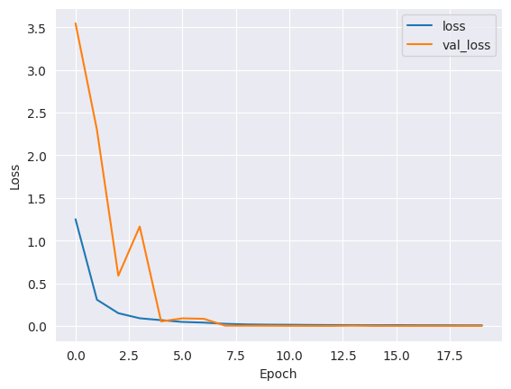
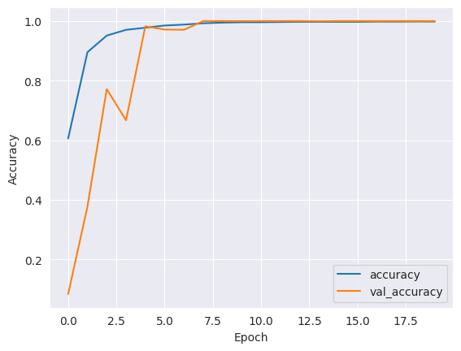
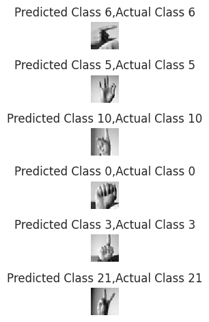

# Building a Convolutional Neural Network for Classification of Sign Language
Multiclass image classification using the Sign Language MNIST dataset with a CNN.

## Introduction
This project focuses on developing a Convolutional Neural Network (CNN) to classify American Sign Language (ASL) hand gestures.  
The dataset used is [Sign Language MNIST](https://www.kaggle.com/datasets/datamunge/sign-language-mnist), consisting of 28x28 pixel grayscale images representing 24 classes (letters J and Z are excluded due to motion requirements).  
There are 27,455 training samples and 7,172 test samples.

Key algorithms used in this project:  
- Convolutional Neural Network (CNN)  
- Data Augmentation (ImageDataGenerator)  
- Adam Optimizer  
- Categorical Crossentropy Loss  

---

## Technical Details
The data preprocessing and model steps used in this project:  
1. **Data Loading and Visualization:** CSV files were read using Pandas, and class distributions were visualized.  
2. **Train/Validation/Test Split:** Training data was split into 80% train and 20% validation.  
3. **Label Binarization:** Labels were one-hot encoded using `LabelBinarizer`.  
4. **Normalization:** Pixel values were scaled to the range 0-1.  
5. **Reshape:** Data reshaped to `(num_samples, 28, 28, 1)` for CNN input.  
6. **Data Augmentation:** Small transformations applied via `ImageDataGenerator` to prevent overfitting.  
7. **Model Architecture:**  
   - 3 Convolution + MaxPooling blocks  
   - Batch Normalization and Dropout for regularization  
   - Flatten and Dense layers  
   - Output layer: softmax for 24 classes  
8. **Training:** The model was trained for 20 epochs with batch_size=128 using training and validation data. `ReduceLROnPlateau` callback was used to dynamically reduce learning rate.

---

## Metrics

- The training and validation accuracy graphs show that the model quickly achieved high accuracy.  
- Model performance on the test dataset:  

- Accuracy of the model is - 100.0 %
- Loss on test set - 0.0021
- These results show that the model classifies almost all classes in the dataset nearly perfectly.
---

#### Training and Accuracy Graphs

#### Loss

#### Accuracy

### Sample Predictions
Below are sample images from the test dataset along with the model predictions:  

---

## Extras
- **Deployment:** The model has not yet been deployed with Streamlit or other UI.  
- **GPU Usage:** Training was performed in Colab GPU environment.  

---

## Conclusion and Future Work
This project successfully developed a high-accuracy CNN model to classify ASL hand gestures.  

Future improvements could include:  
- Deploying the model for real-time camera input (UI/Streamlit)  
- Extending the dataset to include letters J and Z  
- Making the model lightweight for mobile deployment  
- Using Transfer Learning to optimize model performance and training time  e  
 
[Sign Language MNIST](https://www.kaggle.com/datasets/datamunge/sign-language-mnist)
